<div align="center">


&nbsp;&nbsp;&nbsp;&nbsp;&nbsp;&nbsp;
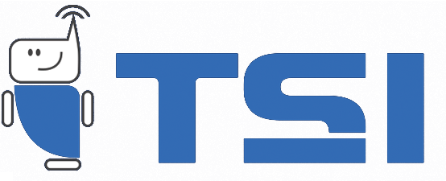

<br/>

### Universidade Tecnológica Federal do Paraná - UTFPR
**Campus Guarapuava · Tecnologia em Sistemas para Internet (TSI)**
*Engenharia de Software (SI104C) · Exame de suficiência*

# 🧭 Engenharia de Software

### A ementa inteira da disciplina em 8 tópicos, com laboratórios animados, questões comentadas e simulado cronometrado


**Aluno:** Ricardo Martins de Oliveira · [GitHub](https://github.com/Roliveira96) · [LinkedIn](https://www.linkedin.com/in/ricardodeoliveira96/) · [rmo.dev.br](https://rmo.dev.br)
**Docente avaliadora:** Profª. Renata Stange

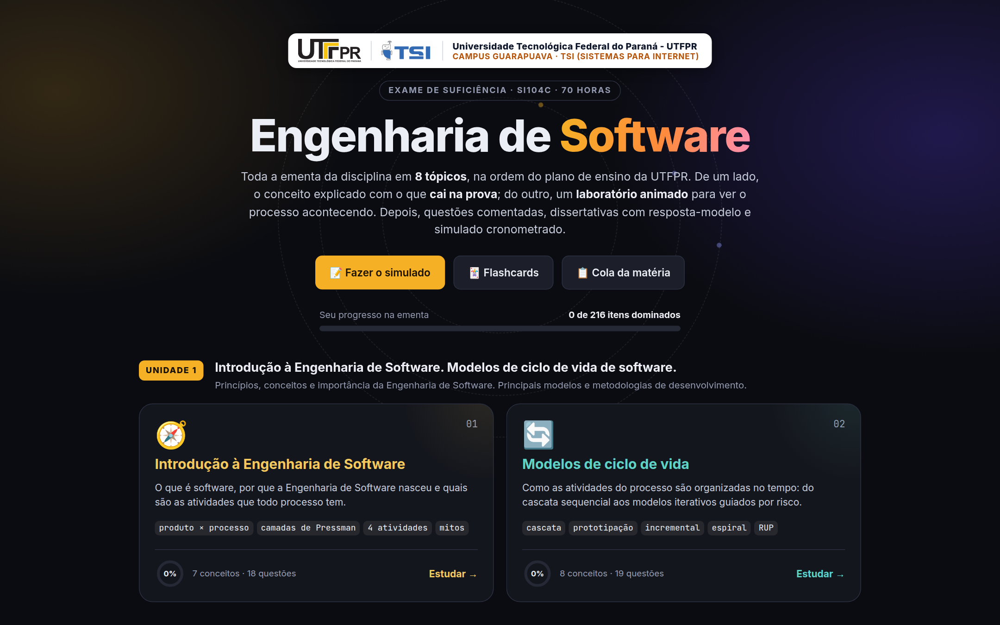

</div>

---

## 📑 Sumário

- [O sistema em imagens](#-o-sistema-em-imagens)
- [Como rodar](#-como-rodar)
- [Como estudar com o material](#-como-estudar-com-o-material)
- [Conteúdo: a ementa oficial, tópico por tópico](#-conteúdo-a-ementa-oficial-tópico-por-tópico)
- [Os laboratórios](#-os-laboratórios)
- [Simulado e flashcards](#-simulado-e-flashcards)
- [Estrutura do projeto](#-estrutura-do-projeto)
- [Animações fluidas, medidas](#-animações-fluidas-medidas)
- [Testes](#-testes)
- [Bibliografia](#-bibliografia)

---

## 📸 O sistema em imagens

Um passeio rápido pelo que o material oferece. Todas as imagens são capturas reais do sistema rodando.

**1. Estudo guiado, com o que cai na prova, macete e uma curiosidade em cada conceito.** À direita, o laboratório toca sozinho e explica cada passo.

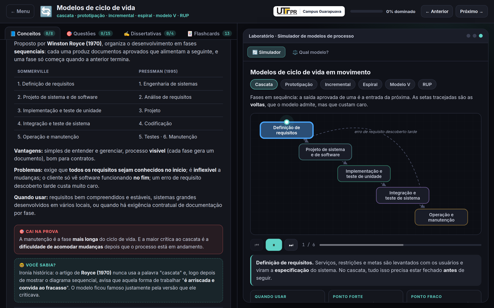

**2. Simulador de modelos de processo.** O ponto luminoso percorre a espiral de Boehm enquanto a legenda narra cada setor.

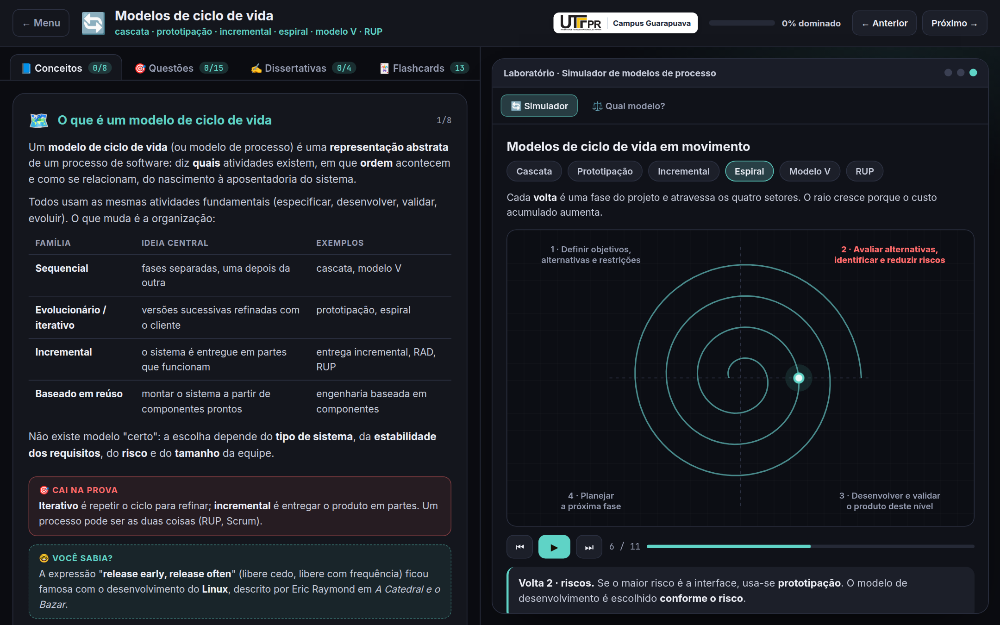

**3. Simulador de Sprint.** Os cartões andam no quadro, o papel responsável acende e o burndown é desenhado dia a dia.

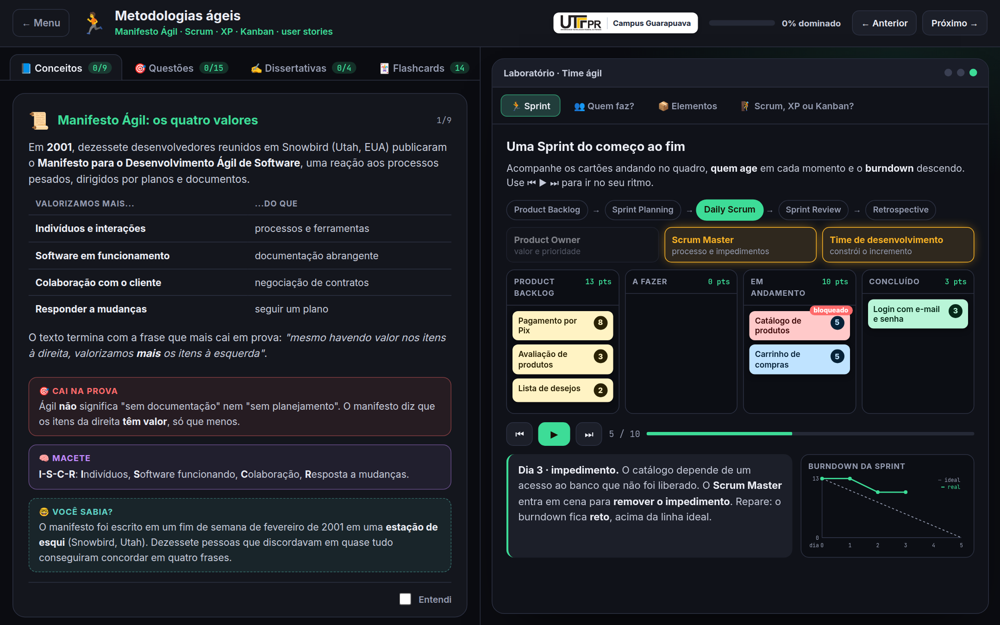

**4. Questões comentadas e diagrama de casos de uso.** Errou? A explicação aparece na hora.

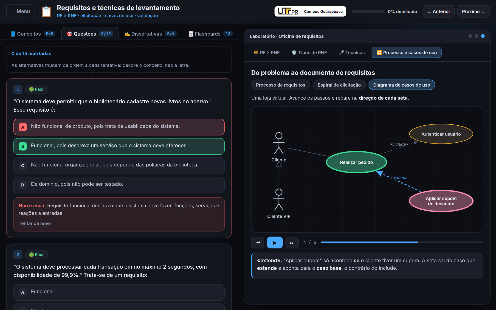

**5. Dissertativas com resposta-modelo.** O aluno escreve, compara e marca os pontos que não podem faltar.

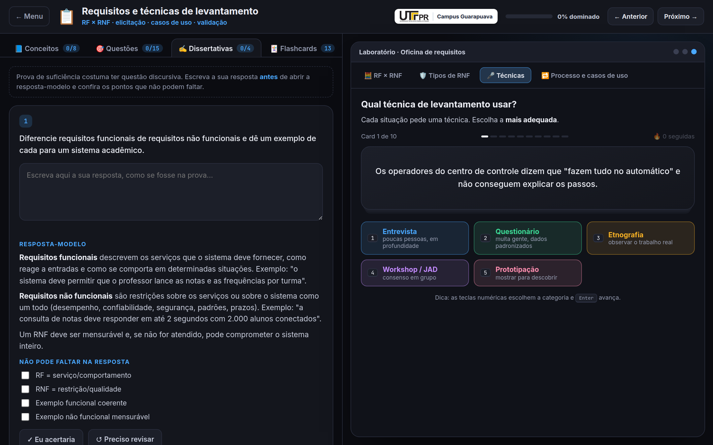

**6. Calculadora de pontos por função** e **mesa de Planning Poker.**

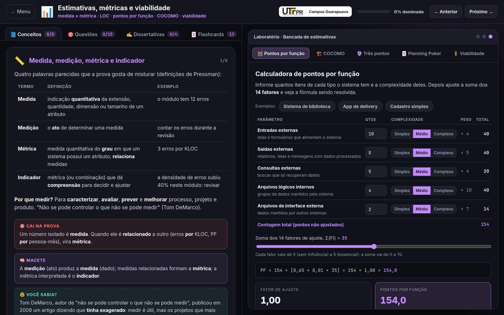

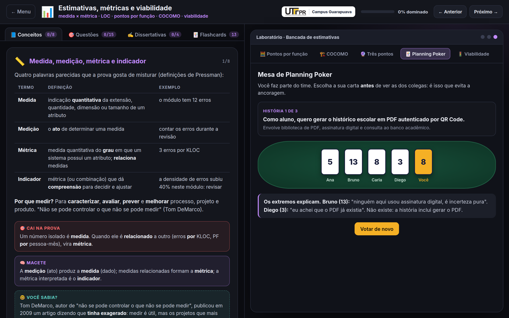

**7. Roda da qualidade (ISO/IEC 9126).**

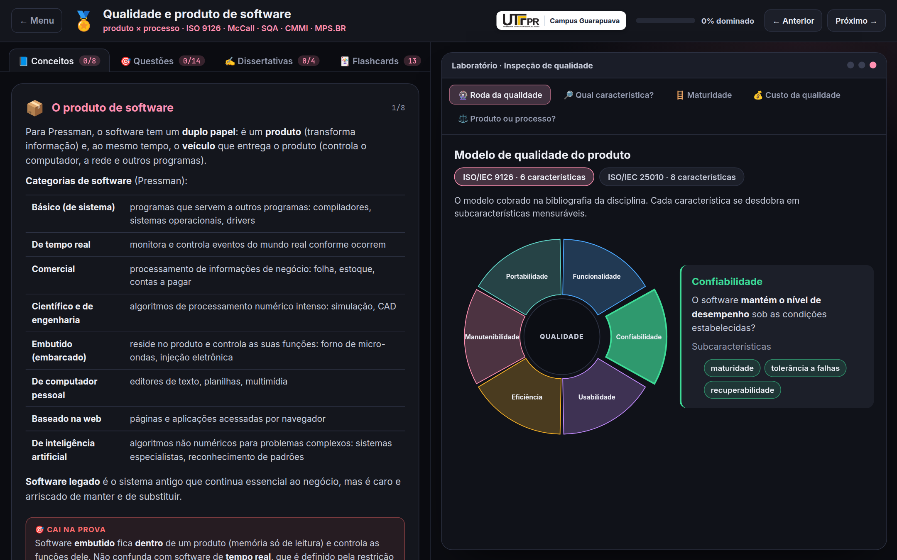

**8. Teste caixa-preta e caixa-branca na prática:** classes de equivalência com valores limite, e grafo de fluxo com complexidade ciclomática.

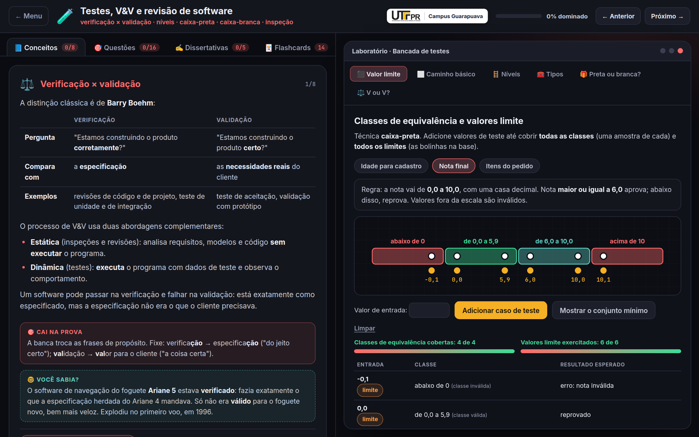

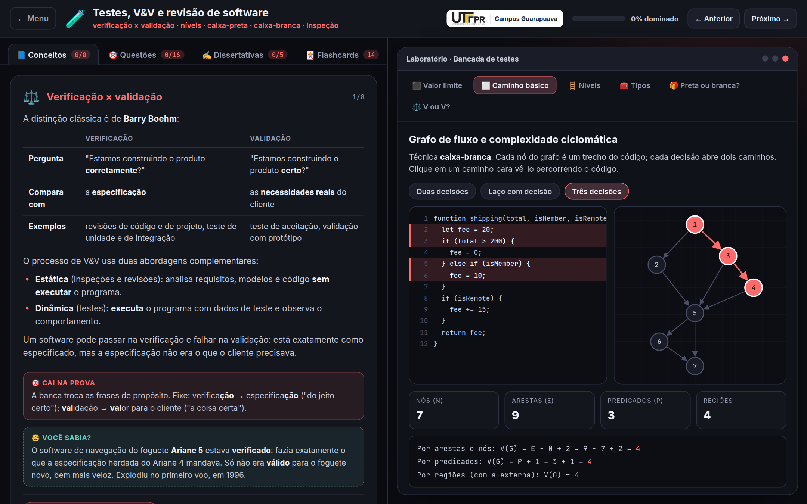

**9. Estratégias de implantação na linha do tempo.**

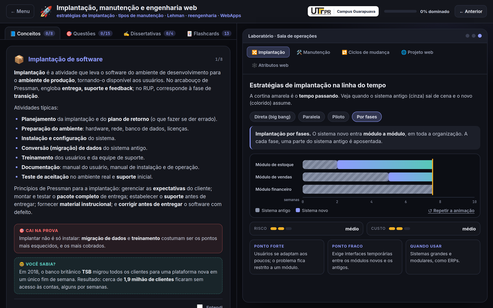

**10. Simulado cronometrado, com nota e gabarito comentado.**

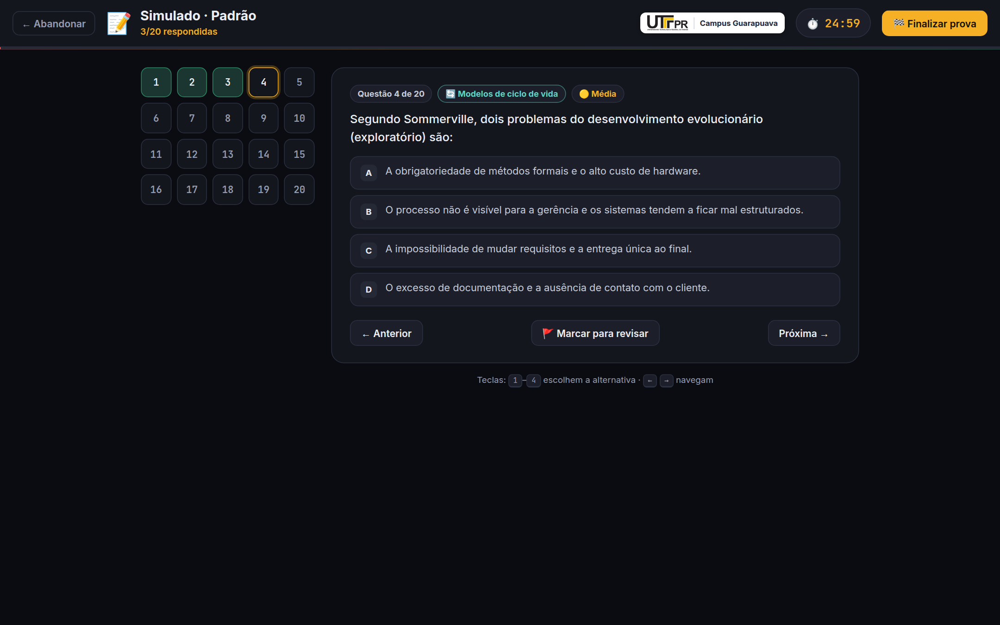

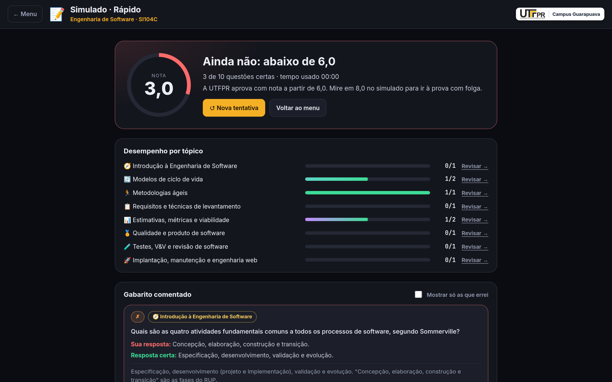

**11. Flashcards para a revisão final.**

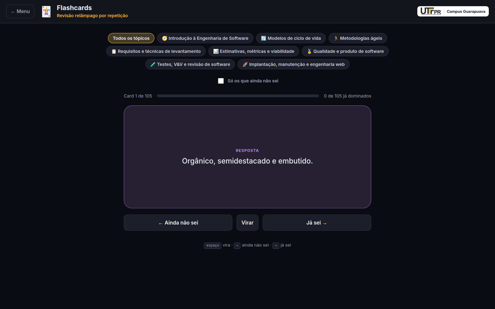

---

## 🚀 Como rodar

**Pré-requisito:** [Node.js](https://nodejs.org) 20.19+ ou 22.12+.

```bash
git clone git@github.com:Roliveira96/exame-engenharia-software.git
cd exame-engenharia-software
npm install
npm run dev
```

Abra **http://localhost:5174** (a porta é diferente da dos outros exames, para os três poderem rodar ao mesmo tempo).

| Comando | O que faz |
|---|---|
| `npm run dev` | Servidor de desenvolvimento, acessível também pelo IP da rede local |
| `npm test` | Roda os 267 testes automatizados |
| `npm run perf` | Mede a fluidez de cada tela e animação (com o `npm run dev` rodando) |
| `npm run build` | Checa os tipos com `tsc` e gera a versão final em `dist/` |
| `npm run preview` | Serve a versão gerada em `dist/` |
| `node scripts/capture_screenshots.js` | Regera as imagens deste README (com o `npm run dev` rodando) |

O progresso (conceitos entendidos, questões acertadas, flashcards dominados e histórico de simulados) fica salvo no `localStorage` do navegador. O link "Zerar meu progresso", no fim da tela inicial, apaga tudo.

---

## 🎓 Como estudar com o material

Cada tópico divide a tela em duas, no mesmo padrão dos exames de Sistemas Operacionais e de Padrões de Projeto:

- **Esquerda, o estudo.** Quatro abas: **📘 Conceitos** (a teoria em cards, com o que *cai na prova*, um *macete* para lembrar e um *você sabia?* com a história por trás do assunto), **🎯 Questões** de múltipla escolha comentadas, **✍️ Dissertativas** com resposta-modelo e os pontos que não podem faltar, e **🃏 Flashcards**.
- **Direita, o laboratório.** Uma janela com simuladores e jogos daquele tópico. As animações **começam sozinhas** e cada passo fica na tela o tempo necessário para ler a legenda (a barrinha clara mostra a contagem). O botão **▶** de cada conceito abre o laboratório exatamente no ponto que ilustra aquele assunto.

Roteiro sugerido:

1. Leia o card do conceito e marque **Entendi**.
2. Clique em **▶** e veja o conceito em movimento; use ⏮ ⏸ ⏭ para pausar e ir no seu ritmo.
3. Responda as questões. As alternativas são embaralhadas a cada tentativa, então não adianta decorar a letra.
4. Escreva a resposta das dissertativas **antes** de abrir a resposta-modelo.
5. Feche o tópico com os flashcards e, no fim, faça o simulado.

---

## 📚 Conteúdo: a ementa oficial, tópico por tópico

O menu segue as quatro unidades do conteúdo programático da disciplina:

| Unidade | # | Tópico | O que cobre |
|---|---|---|---|
| **1** | 01 | 🧭 Introdução à Engenharia de Software | Software e produto de software, crise do software, camadas de Pressman, atividades do processo, atributos de um bom software, mitos |
| **1** | 02 | 🔄 Modelos de ciclo de vida | Cascata, prototipação, evolucionário e incremental, RAD, espiral, modelo V, RUP, como escolher |
| **2** | 03 | 🏃 Metodologias ágeis | Manifesto Ágil, Scrum (papéis, eventos, artefatos), XP, Kanban e Lean, histórias de usuário |
| **2** | 04 | 📋 Requisitos e técnicas de levantamento | RF × RNF × domínio, tipos de RNF, processo de requisitos, técnicas de elicitação, casos de uso, validação e gerenciamento |
| **3** | 05 | 📊 Estimativas, métricas e viabilidade | Medida × métrica, LOC, pontos por função, COCOMO, três pontos, story points, estudo de viabilidade |
| **3** | 06 | 🏅 Qualidade e produto de software | Produto × processo, ISO/IEC 9126 e 25010, McCall, garantia × controle, custo da qualidade, CMMI e MPS.BR |
| **4** | 07 | 🧪 Testes, V&V e revisão de software | Verificação × validação, níveis e tipos de teste, caixa-preta e caixa-branca, complexidade ciclomática, inspeções |
| **4** | 08 | 🚀 Implantação, manutenção e engenharia web | Estratégias de implantação, tipos de manutenção, leis de Lehman, reengenharia, atributos e projeto de WebApps |

Em números: **64 conceitos** (cada um com uma curiosidade: a mariposa de Grace Hopper, a explosão do Ariane 5, o bloquinho de madeira que virou Palm Pilot...), **119 questões de múltipla escolha** (fáceis, médias e difíceis), **33 dissertativas** com resposta-modelo, **105 flashcards** e **221 situações** nos jogos de classificação.

---

## 🧪 Os laboratórios

| Tópico | O que há no laboratório |
|---|---|
| 01 | Processo de software animado (Sommerville e Pressman), camadas de Pressman, jogo "Mito ou fato?", atributos de qualidade |
| 02 | **Simulador de modelos de processo**: cascata, prototipação, incremental, espiral, modelo V e RUP, passo a passo; jogo "Qual modelo?" |
| 03 | **Simulador de Sprint**: quadro com cartões que andam, papéis em destaque a cada evento e burndown ao vivo; jogos de papéis, elementos e Scrum × XP × Kanban |
| 04 | Jogos RF × RNF × domínio, tipos de RNF e escolha da técnica de levantamento; processo de requisitos e **diagrama de casos de uso** animado |
| 05 | **Calculadoras** de pontos por função, COCOMO básico e três pontos; **mesa de Planning Poker**; dimensões de viabilidade |
| 06 | **Roda da qualidade** (ISO/IEC 9126 e 25010), escada de maturidade CMMI e MPS.BR, custo da qualidade, produto × processo |
| 07 | **Bancada de valor limite** na reta de classes de equivalência, **grafo de fluxo** com V(G) e caminhos independentes; jogos de níveis, tipos, caixa-preta × caixa-branca e V&V |
| 08 | **Linha do tempo das estratégias de implantação**, tipos de manutenção, ciclos de evolução e de reengenharia, pirâmide de projeto de WebApps |

---

## 📝 Simulado e flashcards

**Simulado cronometrado** em três tamanhos: rápido (10 questões, 12 min), padrão (20 questões, 25 min) e completo (40 questões, 50 min). As questões são sorteadas de forma equilibrada entre os tópicos escolhidos e as alternativas mudam de ordem a cada tentativa. Não há correção durante a prova: no fim aparecem a nota de 0 a 10 (aprovação a partir de 6,0, como na UTFPR), o desempenho por tópico e o gabarito comentado, com os erros primeiro.

**Flashcards** para revisão relâmpago: vire o card, diga se já sabe ou não e filtre para rever só o que falta.

A **cola da matéria**, no menu, reúne as definições-chave dos oito tópicos em uma única janela.

---

## 🏗️ Estrutura do projeto

TypeScript puro com Vite, sem frameworks, orientado a objetos. O código (nomes, comentários, mensagens) está em inglês; **todo o texto em português fica em `src/content/`**, porque é o material de estudo.

```
src/
├── app/                    ← Telas e infraestrutura
│   ├── Application.ts          Roteador por hash (#/agile, #/exam, #/flashcards)
│   ├── MenuScreen.ts           Tela inicial, por unidade da ementa
│   ├── TopicScreen.ts          Conceitos, questões, dissertativas e flashcards + laboratório
│   ├── ExamScreen.ts           Simulado: escolha, prova cronometrada e resultado
│   ├── examEngine.ts           Sorteio equilibrado e cálculo da nota (funções puras)
│   ├── FlashcardScreen.ts      Treino de flashcards
│   └── ProgressStore.ts        Progresso salvo no localStorage
├── components/             ← Peças reutilizadas pelos laboratórios
│   ├── DiagramPlayer.ts        Diagramas animados com ponto luminoso (processos, espiral, casos de uso)
│   ├── ClassifierGame.ts       Jogo de classificação por categorias
│   ├── StackExplorer.ts        Pirâmides, pilhas e escadas clicáveis
│   └── StepControls.ts         Controles ⏮ ▶ ⏭ com reprodução automática no ritmo de leitura
├── labs/                   ← Laboratórios específicos
│   ├── LabFactory.ts           Monta o laboratório de cada tópico
│   ├── SprintPanel.ts          Quadro Scrum + burndown
│   ├── WheelPanel.ts           Roda da qualidade
│   ├── RolloutPanel.ts         Linha do tempo das estratégias de implantação
│   ├── estimation/             Pontos por função, COCOMO, três pontos, Planning Poker
│   └── testing/                Valor limite e complexidade ciclomática
├── content/                ← O material de estudo (em português)
│   ├── Topic.ts                Modelo de dados de um tópico
│   ├── introduction.ts … evolution.ts   Os 8 tópicos
│   ├── labs/                   Dados de cada laboratório (modelos, cenários, cartas)
│   ├── course.ts               Unidades da ementa, bibliografia, aluno e professora
│   └── uiText.ts               Textos da interface
└── styles/                 ← CSS por tela
```

Para acrescentar uma questão, basta incluir um objeto no array `questions` do tópico: resposta certa em `answer`, três alternativas erradas em `distractors`. O embaralhamento e o simulado passam a usá-la automaticamente, e os testes conferem o formato.

---

## 🎞️ Animações fluidas, medidas

As animações foram medidas, não só olhadas. O script `npm run perf` abre cada tela no Chrome simulando uma máquina **4 vezes mais lenta**, dispara a animação e registra quadros por segundo, quantas vezes a página foi repintada e o tempo gasto em pintura e rasterização (3 segundos por cenário).

| Cenário | Repinturas antes | Repinturas depois | Pintura + rasterização antes | depois |
|---|---|---|---|---|
| Tópico parado na tela | 364 | **0** | 1474 ms | **0 ms** |
| Diagrama tocando | 366 | **2** | 1460 ms | **24 ms** |
| Grafo de fluxo percorrendo um caminho | 332 | **32** | 3601 ms | **144 ms** |
| Simulado em andamento | 362 | **6** | 570 ms | **8 ms** |
| Fundo animado do menu | 218 (37 fps) | **0** (53 fps) | 470 ms | **0 ms** |

O que mudou: o ponto luminoso dos diagramas saiu de dentro do SVG e virou um elemento movido por `transform`; brilhos com `filter` e desfoques foram trocados por gradientes; barras de progresso e a cortina da linha do tempo passaram a usar `transform` em vez de `width` e `left`. A regra ficou protegida por teste: nenhuma animação infinita ou transição pode mexer em propriedade que force repintura ou novo cálculo de layout.

Quem configurou o sistema operacional para **reduzir movimento** vê tudo sem animação e sem reprodução automática.

---

## ✅ Testes

```bash
npm test
```

Os testes (Vitest) protegem principalmente o **conteúdo**, que é onde um erro custaria caro na véspera da prova:

- toda questão tem resposta, explicação e exatamente três alternativas erradas distintas;
- todo botão ▶ de um conceito aponta para um painel e um modelo que existem no laboratório;
- os diagramas só referenciam nós e setas existentes e cabem na área de desenho;
- nos grafos de fluxo, V(G) confere pelas três fórmulas e os caminhos básicos cobrem todas as arestas;
- as fórmulas de pontos por função, COCOMO e três pontos batem com os exemplos resolvidos nas questões;
- o simulado sorteia sem repetir, distribui por tópico e aprova exatamente a partir de 6,0;
- todo conceito tem a sua curiosidade;
- as folhas de estilo não usam desfoque nem animam propriedades caras (ver a seção anterior).

---

## 📖 Bibliografia

Conteúdo baseado na bibliografia do plano de ensino da disciplina.

**Básica**
- WAZLAWICK, Raul Sidnei. *Análise e projeto de sistemas de informação orientados a objetos*. 2. ed. Elsevier, 2011.
- PRESSMAN, Roger S. *Engenharia de software*. Makron, 1995.
- SOMMERVILLE, Ian. *Engenharia de software*. 8. ed. Pearson Addison-Wesley, 2007.

**Complementar**
- COHN, Mike. *Desenvolvimento de software com Scrum*. Bookman, 2011.
- LARMAN, Craig. *Utilizando UML e padrões*. 3. ed. Bookman, 2007.
- BEZERRA, Eduardo. *Princípios de análise e projeto de sistemas com UML*. 2. ed. Elsevier, 2007.
- FOWLER, Martin. *UML essencial*. 3. ed. Bookman, 2005.
- TELES, Vinícius Manhães. *Extreme Programming*. Novatec, 2004.

---

<div align="center">
  <sub>UTFPR Campus Guarapuava · Engenharia de Software (SI104C) · 2026</sub>
</div>
